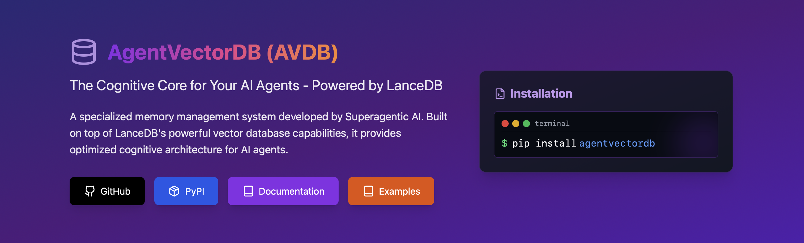
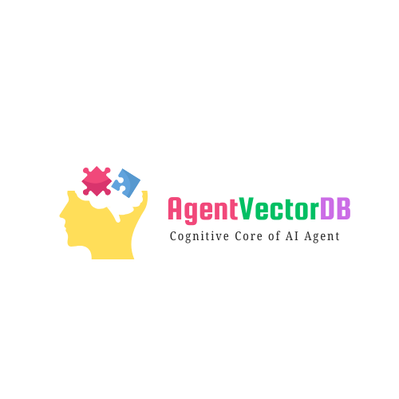

<p align="center">
  
</p>

# AgentVectorDB (AVDB)
<p align="left">
  
</p>

[](https://badge.fury.io/py/agentvectordb)
[](https://pypi.org/project/agentvectordb)
[](LICENSE)
[](https://superagenticai.github.io/agentvectordb)
[](https://github.com/astral-sh/ruff)
[](CONTRIBUTING.md)


> The Cognitive Core for Your AI Agents - Powered by LanceDB

## 📚 Superagentic AI Introduction
  [Superagentic AI Website](https://super-agentic.ai/agent-vectordb)

## 📚 Project Documentation
- [Getting Started](https://superagenticai.github.io/agentvectordb/getting-started)
- [API Reference](https://superagenticai.github.io/agentvectordb/api-reference)
- [Examples](https://superagenticai.github.io/agentvectordb/examples)
- [FAQ](https://superagenticai.github.io/agentvectordb/faq)

## 🌟 Overview
AgentVectorDB (AVDB) is a specialized memory management system developed by [Superagentic AI](https://super-agentic.ai). Built on top of LanceDB's powerful vector database capabilities, it provides optimized cognitive architecture for AI agents.

## 🤝 Built with LanceDB
We extend LanceDB's robust foundation with agent-specific features:
- Agent memory patterns
- Importance scoring
- Context management
- Cognitive state handling

## ✨ Key Features

### Core Capabilities
- **📝 Persistent Storage**: File-based, no server required
- **🔍 Semantic Search**: Efficient ANN search with filtering
- **⚡ Async Support**: High-performance async/await API
- **🎯 Agent-Optimized**: Purpose-built for AI systems

### Advanced Features
- **🔄 Memory Lifecycle**: Complete CRUD operations
- **📊 Batch Processing**: Efficient bulk operations
- **🧹 Smart Pruning**: Intelligent memory management
- **🔧 Flexible Schema**: Dynamic Pydantic schemas
- **⏱️ Time Tracking**: Automatic timestamps

## 📦 Installation

```bash
# Basic installation
pip install agentvectordb

# Development installation
git clone https://github.com/superagenticai/agentvectordb.git
cd agentvectordb
pip install -e ".[dev]"  
#For windows if you encounter UnicodeDecodeError set $env:PYTHONUTF8=1
```

## 🚀 Quick Start

```python
from agentvectordb import AgentVectorDBStore
from agentvectordb.embeddings import DefaultTextEmbeddingFunction

# Initialize store
store = AgentVectorDBStore(db_path="./agent_db")
ef = DefaultTextEmbeddingFunction(dimension=384)

# Create collection
memories = store.get_or_create_collection(
    name="agent_memories",
    embedding_function=ef
)

# Add memories (minimum 8 recommended)
initial_memories = [
    {
        "content": "User prefers dark mode",
        "type": "preference",
        "importance_score": 0.8
    },
    # Add more memories...
]

# Add batch
memories.add_batch(initial_memories)

# Query memories
results = memories.query(
    query_text="user preferences",
    k=2
)
```

## 🛠️ API Overview

### Store Classes

#### AgentVectorDBStore
```python
store = AgentVectorDBStore(db_path="./db")
```

Methods:
- `get_or_create_collection()`
- `list_collections()`

#### AsyncAgentVectorDBStore
```python
store = AsyncAgentVectorDBStore(db_path="./db")
```

### Collection Classes

#### AgentMemoryCollection
Methods:
- `add()`: Add single memory
- `add_batch()`: Add multiple memories
- `query()`: Search memories
- `prune_memories()`: Remove old memories
- `delete()`: Remove memories
- `count()`: Get collection size

## 📚 Advanced Usage

### Custom Embedding Functions

```python
from agentvectordb.embeddings import BaseEmbeddingFunction

class CustomEmbedder(BaseEmbeddingFunction):
    def __init__(self, dimension=384):
        super().__init__(dimension=dimension)
    
    def embed(self, texts):
        # Your embedding logic here
        return vectors
```

### Memory Management

```python
# Prune old memories
pruned = collection.prune_memories(
    max_age_seconds=7*24*3600,  # 7 days
    min_importance_score=0.3
)

# Complex queries
results = collection.query(
    query_text="important task",
    filter_sql="type = 'task' AND importance_score > 0.8",
    k=5
)
```

### Async Operations

```python
async def handle_memories():
    store = AsyncAgentVectorDBStore(db_path="./async_db")
    collection = await store.get_or_create_collection(
        name="async_memories",
        embedding_function=ef
    )
    
    await collection.add_batch(memories)
    results = await collection.query(
        query_text="search term",
        k=5
    )
```

## 🎯 Use Cases

- Personal AI assistants
- Customer service bots
- Research agents
- Task automation agents
- Knowledge management systems
- Learning systems

## 🔄 Memory Types

- Episodic memories
- Semantic knowledge
- Procedural information
- Short-term observations
- Long-term knowledge

## 🛣️ Roadmap

Upcoming features:
- Enhanced filter builders
- Reflection/summarization helpers
- Schema evolution support
- Memory consolidation
- Extended embedding support
- Performance optimizations

## 🤝 Contributing

We welcome contributions! See our [Contributing Guide](CONTRIBUTING.md).

## 📄 License

Licensed under Apache 2.0 - same as LanceDB. See [LICENSE](LICENSE).

## 🙋‍♂️ Support

- GitHub Issues: Technical support
- Email: support@super-agentic.ai
- Enterprise: enterprise@super-agentic.ai

## 🙏 Acknowledgments

Built with ❤️ by [Superagentic AI](https://super-agentic.ai) using [LanceDB](https://github.com/lancedb/lancedb)

---

<p align="center">
  <b>AgentVectorDB: Empower Your AI Agents with Memory!</b>
</p>
